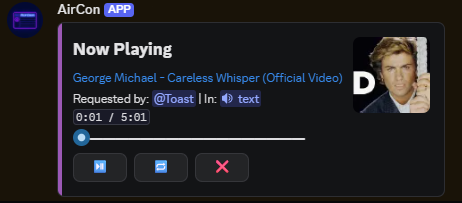
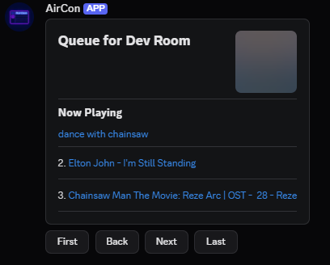

# Aircon

A Discord music bot with a queue engine and audio player written from scratch in TypeScript.

<!-- Suggested image: the Now Playing panel — it's the most visually striking part of the bot
     and the best possible first impression. Crop tight to the embed. -->


---

## About

Aircon started life as a JavaScript bot. This is a complete rewrite, I used the project to learn
TypeScript properly, which meant rebuilding it rather than porting it.

The interesting consequence of that goal: **I wrote the player myself** instead of pulling in
`distube` or a similar library. Queue management, loop modes, history, voice connection
lifecycle, and stream handling are all implemented here. Using a library would have meant learning
its API rather than learning the language and the underlying `@discordjs/voice` primitives, which
was the whole point.

The other design decision worth calling out is **modular extractors** — audio sources are plugins
behind a common interface, so adding a new one never means touching the player. More on that below.

---

## Screenshots

<!-- Suggested image: the paginated queue embed, ideally with 6+ songs so the pagination
     buttons look meaningful. -->
| Queue | Loop controls |
|---|---|
|  |  |

<!-- Suggested image: optional — a short GIF of pressing skip on the Now Playing panel and the
     embed updating in place. GIFs of interactive components are disproportionately convincing.
     Record with ScreenToGif or similar, keep it under ~5 seconds. -->

---

## Features

- Full queue management — add, remove, clear, shuffle, skip, and step backwards through history
- Three loop modes: off, single song, whole queue
- Interactive button controls on the Now Playing and Loop panels (Discord Components V2)
- Paginated queue display
- Per-guild state, so the bot behaves independently in every server it joins
- Automatic cleanup — leaves and tears down the queue when the channel empties or playback finishes
- Pluggable audio sources via the extractor interface

---

## Commands

Default prefix is `!`, configurable in [`src/config.ts`](src/config.ts).

| Command | Alias | Description |
|---|---|---|
| `!play <url or query>` | `!p` | Add a track to the queue and start playing |
| `!nowplaying` | `!np` | Show the current track with progress bar and controls |
| `!queue` | `!q` | Paginated view of upcoming tracks |
| `!skip` | | Skip to the next track |
| `!previous` | | Go back to the previously played track |
| `!pause` | | Pause playback |
| `!resume` | | Resume playback |
| `!loop` | `!l` | Open the loop mode panel (queue / song / off) |
| `!shuffle` | | Shuffle everything after the current track |
| `!remove <n>` | `!rm` | Remove a track from the queue by position |
| `!clear` | | Clear the queue but keep the current track |
| `!stop` | | Stop playback and disconnect |
| `!ping` | `!pong` | Show API latency |

---

## Architecture

```
src/
├── index.ts              Client setup, command loader, event wiring
├── config.ts             Prefix, embed colour, icons
├── Player/
│   ├── Player.ts         Orchestrator — owns all queues, runs extractors, controls playback
│   ├── Queue.ts          Per-guild state: current track, upcoming, history, loop mode
│   ├── Song.ts           Track model with a stream generator
│   └── extractors/
│       ├── BaseExtractor.ts   Abstract contract every source implements
│       └── MP3Extractor.ts    Direct MP3 URL support
├── commands/             One file per command, loaded dynamically at startup
└── utils/                Shared formatting helpers
```

**`Player`** extends `EventEmitter` and owns a `Collection<guildId, Queue>`. It never talks to
Discord directly — it emits (`playSong`, `addSong`, `finish`, `channelEmpty`, `error`) and
`index.ts` decides what to render. That separation means playback logic can change without touching
the messaging layer, and vice versa.

**`Queue`** holds everything scoped to a single guild. Because state is per-guild rather than
global, the bot can play different tracks in different servers simultaneously without any shared
mutable state between them.

**Commands** are dropped into `src/commands/` and picked up automatically — no registration step,
no central import list.

### Writing an extractor

Every audio source implements the same two-method contract:

```ts
export abstract class BaseExtractor {
    abstract readonly name: string;
    abstract validate(query: string): boolean;
    abstract extract(query: string): Promise<Song[]>;
}
```

`Player` walks its extractor list, uses the first one whose `validate()` accepts the query, and
plays whatever `Song` objects come back. Adding a new source means writing one class and adding it
to the list in `index.ts` — the player itself never changes.

```ts
client.player = new Player(client, {
    extractors: [
        new MP3Extractor(),
        // new YourExtractor(),
    ]
});
```
---

## Getting started

### Prerequisites

- **Node.js 18 or newer**
- **FFmpeg** available at runtime (`ffmpeg-static` is included, but a system install is more reliable)
- A Discord bot application with the **Message Content** intent enabled

### Setup

```bash
npm install
```

Copy the env template and add your bot token:

```bash
cp template.env .env
```

```env
TOKEN=your-bot-token-here
```

### Running

```bash
npm run dev     # watch mode, runs from source
npm run build   # compile to dist/
npm start       # run the compiled build
```

### Required intents

The bot needs `Guilds`, `GuildMessages`, `MessageContent`, and `GuildVoiceStates`. `MessageContent`
is privileged — enable it in the Discord Developer Portal under **Bot → Privileged Gateway
Intents**, or the bot will connect but never respond to commands.

---

## Built with

[discord.js v14](https://discord.js.org) · [@discordjs/voice](https://github.com/discordjs/voice) ·
TypeScript · ESM

---
